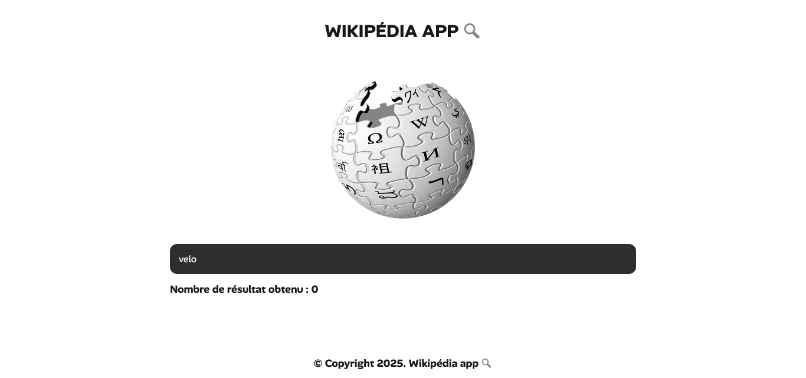

## 🔍 WIKIPEDIA SEARCH APP 🔍

## Le challenge

Mon objectif a été de coder une application de recherche Wikipédia en HTML5, CSS3 et JavaScript. Pour se faire :

- L'internaute doit saisir sa recherche dans le champ de recherche.
- Ensuite, il doit soumettre le formulaire et les résultats vont apparaître.
- Si l'utilisateur soumet le formulaire sans avoir saisi de recherche, une alerte va apparaître sur l'écran.
- Enfin, ce projet est également responsive : il s'adapte au différentes résolutions d'écran desktop, tablette et mobile.

Ce projet m'a permis d'apprendre à utiliser l'API Wikipédia pour effectuer des recherches sur Wikipédia.

## Démonstration

Lien vers le projet : https://aperbet56.github.io/wikipedia_app/

## Projet développé avec

- Utilisation des balises sémantiques HTML5
- CSS3
- Importation de la police "Alan Sans"
- Flexbox
- Animations CSS
- Page web responsive
- Utilisation d'un normaliseur : le fichier normalize.css
- JavaScript
- Code JavaScript commenté
- Utilisation de l'API Wikipédia
- Desktop first
